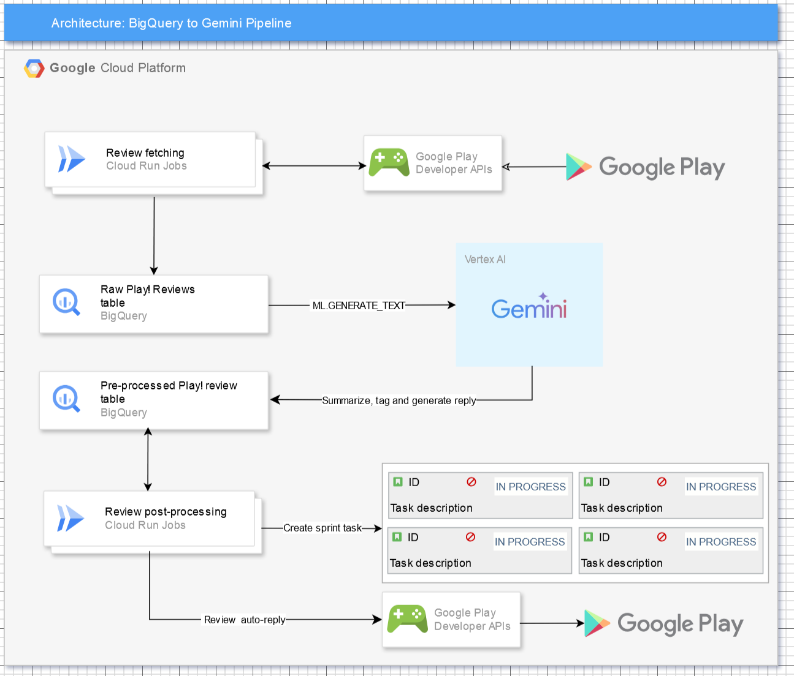

# Play Store Reviews Analysis with Gemini

This project fetches Google Play Store app reviews, stores them in BigQuery, and then uses Google Gemini to analyze the reviews, providing summaries and tagging negative feedback.

## Project Structure

- `main.go`: Main program to fetch reviews, push to BigQuery, and interact with the user.
- `mock-play-api`: A separate Go project that mocks the Google Play Developer API reviews endpoint.  This allows for local testing and development without needing to interact with the actual API.
- `bq-schema`: Contains the schema definitions for the BigQuery tables (`raw_reviews` and `reviews_to_process`).
- `bq_review_analysis.sql`: A BigQuery stored procedure that processes reviews using Google Gemini.

## Project Architecture



## Setup

1. **Install Go:** Ensure you have Go installed.
2. **Set Environment Variables:**
    - `PROJECT_ID`: Your Google Cloud Project ID.
    - `GOOGLE_APPLICATION_CREDENTIALS`: Path to your service account key file.  This file needs the `https://www.googleapis.com/auth/androidpublisher` scope for accessing the Play Store API (or at least read access to BigQuery).
3. **Create BigQuery Dataset and Tables:** Create a BigQuery dataset named `play_store_reviews_demo` and tables `raw_reviews` and `reviews_to_process` using the JSON schema files in the `bq-schema` directory.  

4. **Create Vertex AI connection:** 
You will also need to create a [connection to Vertex AI](https://cloud.google.com/bigquery/docs/generate-text-tutorial-gemini#console_1) and a remote model reference named `gemini_model` that points to your Gemini model:


    ```
    CREATE OR REPLACE MODEL `dn-demos.play_store_reviews_demo.gemini_model`
    REMOTE WITH CONNECTION `us.gemini_analysis`
    OPTIONS (ENDPOINT = 'gemini-2.0-flash-001');
    ```

5. **Run the Mock API (optional):** Navigate to the `mock-play-api` directory and run `go build . && ./mock-play-api`. This starts a local server that mocks the Play Store API.
6. **Run the Main Program:** Navigate to the root directory of this project and run `go run main.go`.  The program will prompt you for the package name and then fetch, process, and analyze the reviews.


## Usage

The program will guide you through the process:

1. Enter the package name of the app you want to analyze.
2. The program will fetch reviews from the mock API (or the real API if you modify the code).
3. It will push the raw reviews to BigQuery.
4. It will then use a BigQuery stored procedure to process the reviews

## Licence

Apache 2.0

This is not an officially supported Google product